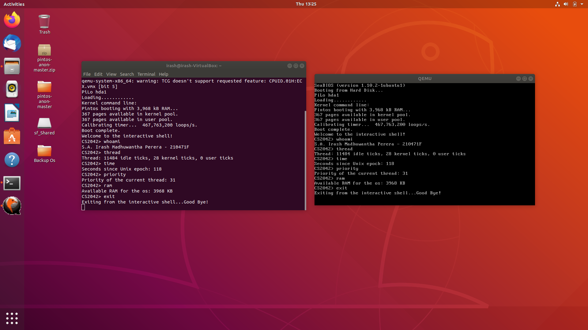
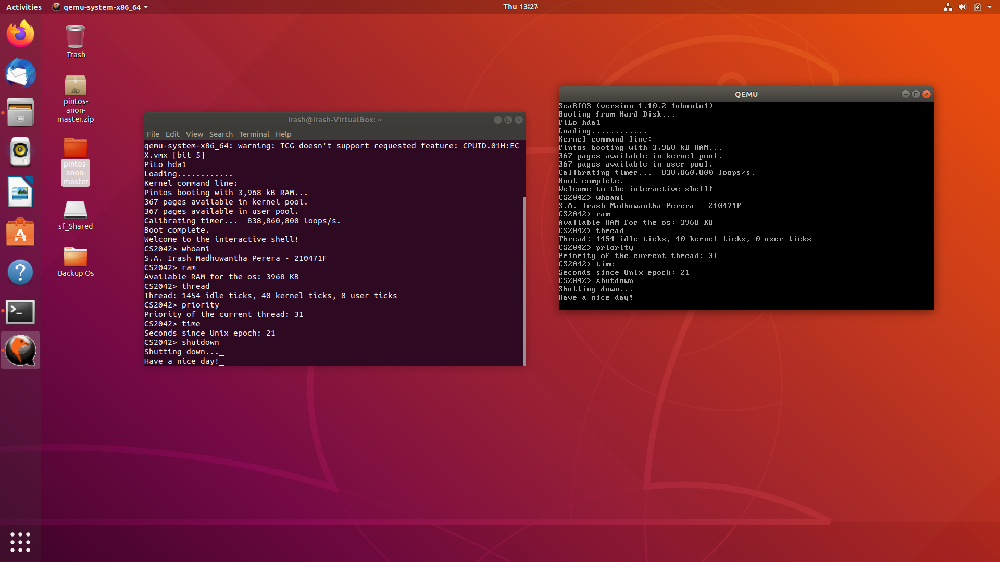

### In this project, I implemented a simple interactive shell that can execute commands and programs. The shell supports the following commands:

**whoami**: Display your name alongside your index number.

**shutdown**: Pintos OS will shutdown and exit the qemu emulator.

**time**: Display the number of seconds passed since Unix epoch.

**ram**: Display the amount of RAM available for the OS
thread Display thread statistics.

**priority**: Display the thread priority of the current thread.

**exit**: Exit the interactive shell.

##### Screenshots

*Shutdown function was delayed 200 clock ticks purposely in order to give time to read the shutting down message.*

